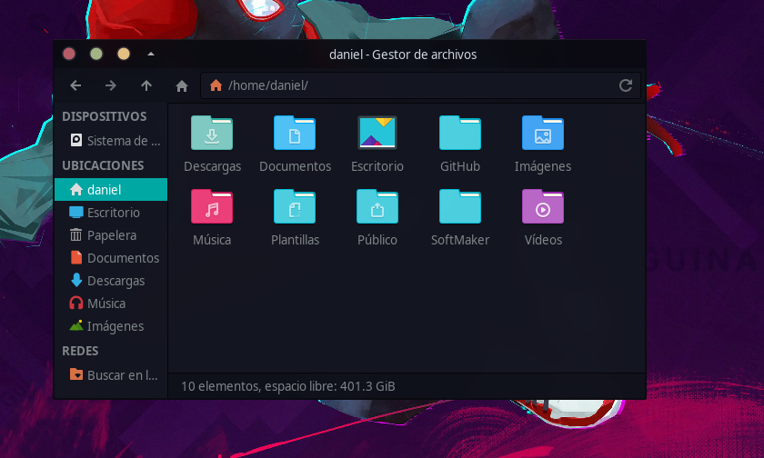

# Folder-Lurfn


Este pequeño proyecto es la fusión de las carpetas del tema [Luv](https://github.com/Nitrux/luv-icon-theme) + iconos del panel lateral (accesos directos) de [Surfn-Orange](https://github.com/erikdubois/Surfn), pensado para trabajar junto a [Papirus-Dark](https://github.com/PapirusDevelopmentTeam/papirus-icon-theme).
Para usar el tema de iconos que más te guste en lugar de Papirus-Dark, modificar la linea del archivo index.theme


``` Inherits = Papirus-Dark ```





**Tema Recomendado**: [Juno-Ocean](https://www.xfce-look.org/p/1280977/)
